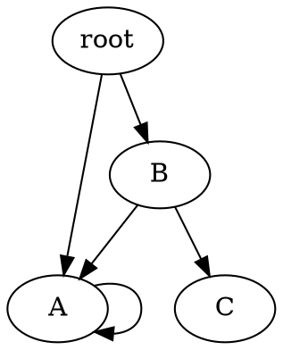

The objective of this tutorial is to experiment with the DOT file format supported in <span style="font-variant: small-caps;">Gegelati</span> to export trained Tangled Program Graphs (TPGs), to visualize their topology, and to import them back in a program.

The following topics are covered in this tutorial:
* Use of the `File::TPGGraphDotExporter` class to serialize pre-trained TPGs into DOT files.
* Visualization of TPG structure evolution throughout the training process using a DOT viewer.
* Creation of an inference-only executable using TPG graphs imported with the `File::TPGGraphDotImporter` class.

The starting point of this tutorial is the C++ project obtained at the end of the _[GEGELATI introductory tutorial](/gegelati-tutorial)_. While completing the introductory tutorial is strongly advised, a copy of the project resulting from this tutorial can be downloaded at the following link: [pendulum_wrapper_solution.zip](/gegelati-tutorial/data/gegelati-tutorial-solution.zip).

## 0. Export TPGs into DOT files.

### The DOT format
DOT is a popular description language that makes it possible to describe graphs with a few lines of code.
With a simple declarative syntax, labeled directed or undirected graphs with homogeneous or heterogeneous types of vertices can be described.
In it simplest form, the DOT syntax (mostly) focuses on the description of the topology of graphs, leaving out graphical and layout concerns.
These graphical and layouting concerns are handled automatically by dedicated visualization tools, such as the open-source [GraphViz](https://graphviz.org/) tool.

A simple example of graph described with the DOT language is presented in the following excerpt:



The visualization of this graph with `xdot` produces the following output:

<div align=center></div>

In <span style="font-variant: small-caps;">Gegelati</span>, the DOT language is used as the serialization file format for exporting, visualizing and importing TPGs.
The general structure used for storing TPGs is as follows:

```dot
/* Header */
digraph{
	graph[pad = "0.212, 0.055" bgcolor = lightgray]  
	node[shape=circle style = filled label = ""]

    /* Team vertex */
    T0 [fillcolor="#1199bb"]

    /* Program */
    P0 [fillcolor="#cccccc" shape=point] //-7|7|0|-4|9|

    /* Program P0 instructions (invisible) */
    I0 [shape=box style=invis label="2|5&2|1#0|4&#92;n1|3&0|7#0|5&#92;n"]
    P0 -> I0[style=invis]

    /* Action vertex */
    A0 [fillcolor="#ff3366" shape=box margin=0.03 width=0 height=0 label="0"]

    /* TPG Edge */
    T0 -> P0 -> A0

    /* Root list */
    { rank= same T0 }
}    
```



### Export TPGs throughout training

To export TPGs in the DOT format, <span style="font-variant: small-caps;">Gegelati</span> provides the `File::TPGGraphDotExporter` class.
Each instance of the `TPGGraphDotExporter` class is associated, on construction to a `TPG::TPGGraph`.
The constructor of the exporter class is declared as follows:

```cpp
/**
 * \brief Constructor for the exporter.
 *
 * \param[in] filePath initial path to the file where the dot content
 *            will be written.
 * \param[in] graph const reference to the graph whose content will
 *            be exported in dot.
 * \throws std::runtime_error in case no file could be opened at the
 *         given filePath.
 */
TPGGraphDotExporter (const char *filePath, const TPG::TPGGraph &graph)
```

While the path of the file where the TPG graph is written can be modified, using the `TPGGraphDotExporter::setNewFilePath(char*)` method, the TPG associated to the exporter on construction can not be changed.
The reason for this constraint is that for a TPG that was already exported, following exports of the TPGs, even after mutations, will keep identical names for teams, programs and actions present in both TPGs, and will create new names for new graphs elements.
Thanks to this features, it is easier to keep track of surviving teams throughout the evolution process.

#### TODO 1:
To print the trained TPG after each generation of the training process, edit the `/gegelati-tutorial/src/training/main-training.cpp` file as follows:
* Instantiate an instance of the `TPGGraphDotExporter` before entering the iterative training process. To retrieve a pointer to the trained TPG, use the following method of the learning agent: `Learn::LearningAgent::getTPGGraph()`.
* Use the instantiated exporter within the iterative training process to export a new dot file after each generation.
  To trigger the printing of a file, use the `TPGGraphDotExporter::print()` method.


```cpp
/* main-training.cpp */
// Create an exporter for all graphs
File::TPGGraphDotExporter dotExporter("tpg_0000.dot", *la.getTPGGraph());

// Train for params.nbGenerations generations
for (int i = 0; i < params.nbGenerations && !exitProgram; i++) {
  la.trainOneGeneration(i);

  // Export dot
  char buff[13];
  sprintf(buff, "tpg_%04d.dot", i);
  dotExporter.setNewFilePath(buff);
  dotExporter.print();    

  // ...
}
```



### Export the cleaned best TPG
During the training process, the pseudo-random nature of the graph and program mutations causes the apparition of useless elements.

**Training roots:**
At the end of the training process, the TPG needs to be exported for further utilization, for example for inferring the pre-trained TPG, as will be done later in this tutorial.
The TPGs exported in the previous step contained all roots present in the TPG at a given generation, which is useful to better understand the training process, but also to pause a training process and restart it later.

When exporting the TPG resulting from the training, only the graph stemming from the root team providing the best results needs to be exported.
To keep only the TPG stemming from the best root, the `Learn::LearningAgent::keepBestPolicy()` method should be used.

**Hitchhiker programs:**
In TPG graphs, so-called "hitchhiker" programs may appear.
A hitchhiker program is a program that belongs to a team with a valuable behavior without contributing to this useful behavior itself.
A team has a valuable behavior if it helps the TPG to which it belongs to obtain better rewards.
A hitchhiker program is a program that belongs to a valuable team, but that never produces a winning bid when programs of this team are executed.
Because the team has a valuable behavior, it will survive with many generations, with all its programs, including the useless hitchhiker program.

To identify these hitchhiker programs, the execution of TPG graphs must be instrumented in order to keep track of how many times each team was visited, and how many times each program produced a winning bid.
This instrumentation of the TPG graph is achieved by specifying a specialized TPG factory when instantiating the learning agent.
This can be achieved as follows:
```cpp
Learn::LearningAgent la(pendulumLE, instructionSet, params, TPG::TPGInstrumentedFactory());
```

After the training process, hitchhiker programs can be cleaned from the TPG using a helper method from this factory, as follows:
```cpp
// Clean unused vertices and teams
std::shared_ptr<TPG::TPGGraph> tpg = la.getTPGGraph();
TPG::TPGInstrumentedFactory().clearUnusedTPGGraphElements(*tpg);
```

**Introns**:
In Programs, it is very common to observe so-called "intron" instructions that do not directly contribute to the data path leading to the result returned by the program.
While these instructions are automatically detected and skipped during program execution, they may still be valuable during the training process, as they act as dormant genes that may be activated again during future mutations.

When exporting a TPG graph, these introns only pollute the exported graph, and should thus be removed using the `TPG::TPGGraph::clearProgramIntrons()` method.

#### TODO #2:
Update the instatiation of the `Learn::LearningAgent` to use the `TPG::TPGInstrumentedFactory`.
Then, after the end of the iterative training process:
* Keep only the best root in the trained TPG.
* Remove all its hitchhiker programs.
* Clear all introns.
* Export the resulting TPG in a dedicated DOT file.


```cpp
/* main-training.cpp: After the for loop. */

// Clean unused vertices and teams
std::shared_ptr<TPG::TPGGraph> tpg = la.getTPGGraph();
TPG::TPGInstrumentedFactory().clearUnusedTPGGraphElements(*tpg);

// Keep only the best root
la.keepBestPolicy();

// Clean introns
tpg->clearProgramIntrons();

// Print the resulting TPG
dotExporter.setNewFilePath("best_tpg.dot");
dotExporter.print();
```


## 1. Visualization of TPG graphs.
To visualize TPGs described with DOT, a dedicated tool can be installed on your computer, such as graphviz.
Alternatively, several website propose online viewers for graphs described with the DOT language.
For example, [Edotor](https://edotor.net/), [GraphvizOnline](https://dreampuf.github.io/GraphvizOnline/), or [GraphViz Visual Editor](http://magjac.com/graphviz-visual-editor/) can be used to follow this tutorial.

### TPG graphical semantics
An excerpt of the visual representation of a TPG produced by GraphViz is presented hereafter:
<div align="center"></div>

The large colored circles in the graph represents the teams of the TPG.
At the top of the image, the two darker teams are root teams of the TPG.
Lighter teams are internal teams of the TPG, referenced in the graph stemming from at least one root of the TPG.
The red rectangles represent the actions of the TPG.
The integer numbers in the action rectangles represent the numbers associated to the discrete actions available in the learning environment.
Finally, arrows linking teams to other teams of actions are separated in two halves: the first one linking the team to a program, represented with a tiny circle, and the second one linking the program to its destination team or action.
In case several edges starting from different teams share a common program and destination, a single arrow exists between the program and its destination.

### In-training TPGs and emergent behavior

The training meta-parameters used in this tutorial, specified in `gegelati-tutorial/params.json`, specify that the trained TPG should contain 150 roots at each generation, 80% of which are removed during the decimation process.
Hence, the DOT graph exported after each generation contain 30 root teams, which make them quite large when visualized.

The first observable feature of TPGs during the training process are their maximum depth from root to actions.
When the learning agent and the trained TPG are first initialized, the number of created root is equal to the number of actions available the TPG.
Each of this root is connected to two actions, such that each action is itself connected to two roots.
Hence, at initialization, the depth of the TPG is 1 between roots and actions.

During the any iteration of the natural selection training process, additional roots are added to the TPGs to reach the desired 150 roots.
These roots are obtained by cloning and mutating existing teams from the TPG.
During this mutation process, program of mutated team can change their destination among surviving teams from the previous generation, but can never point towards another root introduced at the same generation.
Hence, the maximum depth of the TPG can increase, at most, by one at each generation.
This is why, when observing the TPG resulting from the first generation, the graph should contain
30 roots with a maximum depth of 2 between roots and actions.

In practice, the maximum depth of the TPG remains relatively stable, unless one of the root teams discovers a new valuable strategy.
Indeed, in the absence of a reward breakthrough most newly introduced team, which may be responsible for an increase of the TPG depth, won't survive any generation.
Thanks to this property, the depth of the TPG graphs automatically reflects the complexity of the strategy deployed for maximizing their rewards.
Hence, when visualizing the TPGs obtained during the first generation, you will most likely not notice a big change in the maximum depth of the TPG.

When a root team with a valuable behavior appears, it will survive for many generations, thus increasing its chance of being itself referenced by a new root team bringing further improvement of the TPG reward.
When becoming an internal (i.e. non-root) team of the TPG, a team is protected from decimation, which further increases its life-span, and its chance of being referenced during future mutations.
This natural self preservation of valuable behavior is called the emergent hierarchal structure of TPGs.

#### TODO #3:
Visualize the TPG obtained during throughout the training process, and the structure of the best TPG exported when exiting the training process.

## 2. Standalone inference from imported DOT file.
Once a pre-trained TPG is exported, an import feature is indispensable to enable using this TPG for inference purposes.
In this step, you will create an inference executable base on a TPG exported in the DOT format.

### Creation of a new executable in the CMake project.
#### TODO #4
1. Create a new `gegelati-tutorial/src/inference/main-inference.cpp` file.
2. Update the CMake configuration file to add a new target to the project. To do that, add the following lines at the end of the `gegelati-tutorial/CMakeLists.txt` file:
```cmake
# Sub project for inference
file(GLOB
	inference_files
	./src/inference/*.cpp
	./src/inference/*.h
	params.json
)
add_executable(tpg-inference ${pendulum_files} ${inference_files})
target_link_libraries(tpg-inference ${GEGELATI_LIBRARIES} ${SDL2_LIBRARY} ${SDL2IMAGE_LIBRARY} ${SDL2TTF_LIBRARY})
target_compile_definitions(tpg-inference PRIVATE ROOT_DIR="${CMAKE_SOURCE_DIR}")
```
3. Re-generate the project for your favorite IDE using appropriate CMake commands.

### Importing TPG for inference.
