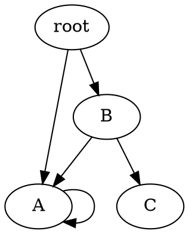

The objective of this tutorial is to experiment with the DOT file format supported in <span style="font-variant: small-caps;">Gegelati</span> to export trained Tangled Program Graphs (TPGs), to visualize their topology, and to import them back in a program.

The following topics are covered in this tutorial:
* Use of the `File::TPGGraphDotExporter` class to serialize pre-trained TPGs into DOT files.
* Visualization of TPG structure evolution throughout the training process using a DOT viewer.
* Creation of an inference-only executable using TPG graphs imported with the `File::TPGGraphDotImporter` class.

The starting point of this tutorial is the C++ project obtained at the end of the _[GEGELATI introductory tutorial](/gegelati-tutorial)_. While completing the introductory tutorial is strongly advised, a copy of the project resulting from this tutorial can be downloaded at the following link: [pendulum_wrapper_solution.zip](/gegelati-tutorial/data/gegelati-tutorial-solution.zip).

## 0. Export TPGs into DOT files.

### The DOT format
DOT is a popular description language that makes it possible to describe graphs with a few lines of code.
With a simple declarative syntax, labeled directed or undirected graphs with homogeneous or heterogeneous types of vertices can be described.
In it simplest form, the DOT syntax (mostly) focuses on the description of the topology of graphs, leaving out graphical and layout concerns.
These graphical and layouting concerns are handled automatically by dedicated visualization tools, such as the open-source [GraphViz](https://graphviz.org/) tool.

A simple example of graph described with the DOT language is presented in the following excerpt:



The visualization of this graph with `xdot` produces the following output:

<div align=center></div>

In <span style="font-variant: small-caps;">Gegelati</span>, the DOT language is used as the serialization file format for exporting, visualizing and importing TPGs.

### Export TPGs throughout training

To export TPGs in the DOT format, <span style="font-variant: small-caps;">Gegelati</span> provides the `File::TPGGraphDotExporter` class.
Each instance of the `TPGGraphDotExporter` class is associated, on construction to a `TPG::TPGGraph`.
The constructor of the exporter class is declared as follows:

```cpp
/**
 * \brief Constructor for the exporter.
 *
 * \param[in] filePath initial path to the file where the dot content
 *            will be written.
 * \param[in] graph const reference to the graph whose content will
 *            be exported in dot.
 * \throws std::runtime_error in case no file could be opened at the
 *         given filePath.
 */
TPGGraphDotExporter (const char *filePath, const TPG::TPGGraph &graph)
```


### Export the best TPG

## 1. Visualization of TPG graphs.

## 2. Standalone inference from imported DOT file.

### Creation of a new executable in the CMake project.

### Importing TPG for inference.
